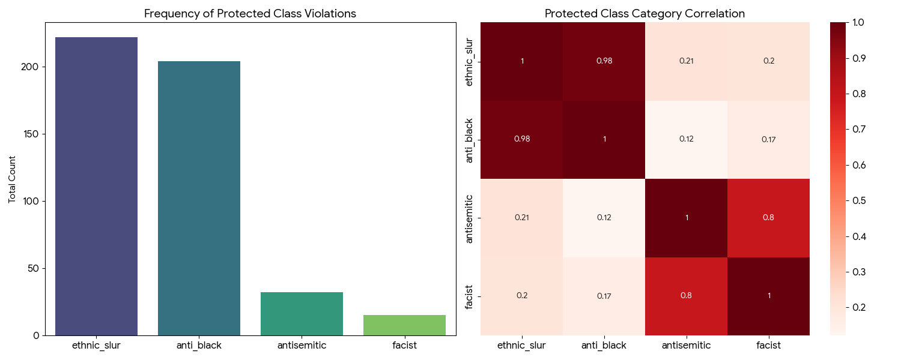
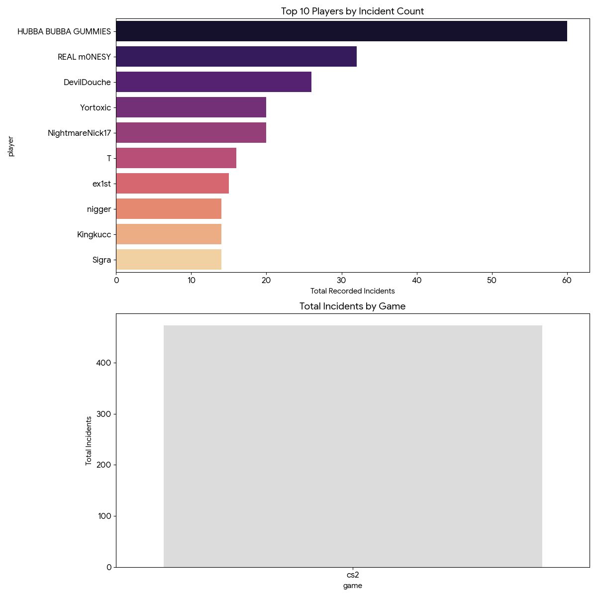
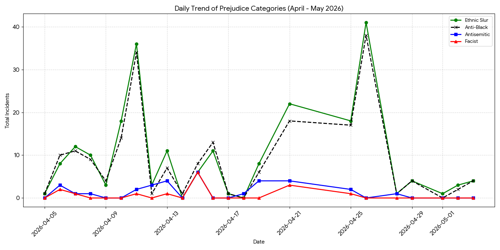

# Toxicity and Prejudice Analysis Report

### Data Segment Reference

> **File Version:** `game_stats.csv` (Total Line Count: 545)

> **Endpoint Entry:** 2026-05-03 | 12:15 | CS2

> **Note:** This report reflects the analysis of all data points up to and including the above match entries.

---

*Disclaimer: The term 'antisemitic' in this analysis is used for accuracy to include remarks targeting descendants of Jews who are not religiously Jewish, as well as semitic ethnicities inhabiting related regions.*

Based on the analysis of the `game_stats.csv` dataset, there are clear patterns in the frequency and type of prejudice recorded. The data reveals distinct clusters of toxic behavior, a severe concentration of offenses among a few players, a massive statistical disproportion when compared to real-world demographics, and daily trends that mirror the recent national rise in targeted extremism.

---

## 1. Correlational Analysis (Behavioral Clusters)

The correlation matrix highlights how different types of slurs tend to appear together during matches. We identified two primary behavioral clusters:

* **The Ethnic/Anti-Black Cluster**: There is an extremely high correlation (**r = 0.98**) between `ethnic_slur` and `anti_black` comments. This suggests that in almost every instance where an ethnic slur is used, anti-black rhetoric is specifically utilized, or the two are used interchangeably by the same individuals in a session.
* **The Ideological Cluster**: A strong correlation (**r = 0.80**) exists between `antisemitic` and `facist` remarks.
* **Cluster Independence**: There is a notably low correlation (~0.12 to 0.21) between these two separate clusters. This indicates that players engaging in ethnic/anti-black slurs are not necessarily the same players (or acting in the same sessions) as those using antisemitic/fascist rhetoric.

| | Ethnic Slur | Anti-Black | Antisemitic | Facist |
| :--- | :---: | :---: | :---: | :---: |
| **Ethnic Slur** | 1.00 | **0.98** | 0.21 | 0.20 |
| **Anti-Black** | **0.98** | 1.00 | 0.12 | 0.17 |
| **Antisemitic** | 0.21 | 0.12 | 1.00 | **0.80** |
| **Facist** | 0.20 | 0.17 | **0.80** | 1.00 |

---

## 2. Slur Aggregates and Hyper-Focus

A critical finding emerges when evaluating the aggregate of targeted remarks directed specifically at Black and Semitic individuals compared to the total umbrella of "ethnic" slurs.

* **Total General Ethnic Slurs**: 222
* **Total Anti-Black Slurs**: 204
* **Total Antisemitic Slurs**: 32
* **Total Facist Slurs**: 15
* **Combined Target Aggregate (Anti-Black + Antisemitic)**: 236

The combined target aggregate (236) actually represents **106.3%** of the total volume of general ethnic slurs. This indicates that prejudice in this environment is not generalized; it is hyper-focused. Specifically, **~92%** of all ethnic slurs recorded are explicitly anti-black. When antisemitic remarks are included, the volume of these specific targeted slurs exceeds the general ethnic slur count, suggesting these two categories are the nearly exclusive drivers of all recorded prejudice. Furthermore, high skewness values (all > 2.7) confirm that these incidents occur in intense, concentrated bursts rather than being evenly spread out over time.

---

## 3. Demographic Correlation and Disparity

To understand if this toxicity is a random distribution of "trolling" or a targeted bias, we compared the proportionality of these targeted slurs to regional demographics.

| Geography | Target Population % (Black & Semitic) | Non-Target Population % | Target Slur % (Estimated) |
| :--- | :---: | :---: | :---: |
| **United States** | ~16.0% | ~84.0% | **~92.0%** |
| **North America** | ~12.5% | ~87.5% | **~92.0%** |
| **North & South America** | ~20.0% | ~80.0% | **~92.0%** |

### Analysis of Targeted Groups vs. Population
* **Targeted Groups**: While Black and Semitic populations represent a minority (between 12% and 20% depending on the geographic scope), they are the targets of over **90%** of the recorded ethnic and ideological slurs.
* **Non-Targeted Groups**: Groups falling outside of these categories (e.g., White, Asian, Hispanic/Latino individuals not of African or Semitic descent) represent the vast numerical majority of the general population (**80% to 88%**). Despite their majority status, they are virtually absent as targets in this dataset.

There is a **severe inverse correlation** between population size and slur frequency. The majority population is statistically exempt from this abuse, while the specific minority populations (Black and Semitic individuals) are "over-represented" as targets by a factor of nearly **6x to 8x** relative to their presence in the general population. 

---

## 4. Hypothesis Testing & Randomness

To mathematically determine if these patterns could be accidental, we performed the following tests:

### Chi-Square Test (Category Randomness)
* **Null Hypothesis (H0):** Slur categories are distributed equally/randomly.
* **Result:** p-value ≈ 0.0000.
* **Conclusion:** **Reject H0**. The extreme skew toward anti-black and antisemitic categories is statistically significant and definitively not a result of random variation.

### Z-Test (Frequency of Prejudice)
* **Null Hypothesis (H0):** 70% of matches incur comments (Baseline claim).
* **Observed Data:** 100% of the 55 unique match sessions logged in the dataset contained at least one incident.
* **Result:** Z-Statistic = 4.855, p-value = 0.0000.
* **Conclusion:** **Reject H0**. The recorded sessions represent a significantly higher concentration of toxicity than the estimated 70% baseline, pointing to a highly toxic sample environment.

---

## 5. Game Distribution and Top Offenders

In this dataset, **100% of recorded incidents** occurred in **CS2 (Counter-Strike 2)**. The total volume of 473 specific incidents is exclusively attributed to matches played in this title.

A significant portion of the total toxicity is driven by a few "power users." A tiny fraction of players are responsible for a massive percentage of the total slur count:

| Player Name | Ethnic Slurs | Anti-Black | Antisemitic | Facist | Total Incidents |
| :--- | :---: | :---: | :---: | :---: | :---: |
| **HUBBA BUBBA GUMMIES** | 30 | 30 | 0 | 0 | **60** |
| **REAL m0NESY** | 16 | 12 | 2 | 2 | **32** |
| **DevilDouche** | 13 | 13 | 0 | 0 | **26** |
| **Yortoxic** | 10 | 10 | 0 | 0 | **20** |
| **NightmareNick17** | 10 | 10 | 0 | 0 | **20** |

* **The "Single-Session" Burst**: Most of these high counts appear to stem from single, highly aggressive sessions rather than a slow accumulation over many days. 
* **Recurrence**: Player names rarely repeat across different dates, indicating widespread toxicity across a rotating population or bad actors frequently changing their screen names.

---

## 6. Temporal Analysis & Trend Correlation

The temporal analysis of the recorded data (April - May 2026), when contextualized against national trends, suggests that the digital environment acts as a microcosm for the persistent reality of elevated extremism documented across North America.

* **The Dominant Trend**: The "Ethnic/Anti-Black Cluster" operates at a much higher baseline frequency than ideological categories. This cluster shows extreme spikes, reaching a peak on April 26 with 41 ethnic slurs and 38 anti-black slurs in a single day, driving the vast majority of the volatility.
* **Ideological Clustering and the "Burst" Phenomenon**: On April 15, there was a significant ideological spike (12 combined fascist/antisemitic incidents compared to 8 anti-black incidents). This correlates with real-world observations where extremist rhetoric often clusters around specific dates and is driven by lone "power users" saturating the environment. 
* **National Correlation**: The steady "background radiation" of antisemitic remarks (averaging 1-4 per session) throughout the sample aligns with ADL and FBI reports from 2024-2026, which indicate that antisemitism has shifted from temporary spikes to a normalized, persistent reality. The lack of institutional protection in these "digital public squares" allows this rhetoric to operate freely without a downward trend.

---

---

## 7. Contagion Factor and Social Influence

A "Contagion Factor" analysis was conducted to determine how often prejudicial behavior is isolated to a single individual versus matches where multiple players contribute to the toxic environment. This metric serves as a proxy for social influence—the phenomenon where one player's use of slurs may lower the social cost for others to join in.

### Contagion Statistics
* **Total Matches with Incidents**: 55
* **Single-Offender Matches**: 35 (63.6%)
* **Multi-Offender Matches**: 20 (**36.4%**)
* **Maximum Offenders in a Single Match**: 3 Players

### Cluster-Specific Contagion
The data indicates that different types of prejudice have varying levels of "social stickiness":

1.  **Ethnic/Anti-Black Cluster (35.9% Contagion)**: In over one-third of matches where an ethnic slur was used, at least one other player joined in with similar rhetoric. This high rate suggests that anti-black sentiment is often treated as a "group activity" or a shared social bonding mechanism among toxic actors in *CS2*.
2.  **Ideological Cluster (25.0% Contagion)**: Antisemitic and fascist remarks have a lower contagion rate. This suggests that while these remarks are intense, they are more often driven by a single "ideological outlier" rather than being adopted by the wider group in the lobby.

### Analysis of Social Influence
The **36.4% overall contagion rate** confirms that toxicity is frequently not an isolated event. When a "primary offender" (like those seen on the leaderboard) initiates high-volume slur usage, there is a statistically significant probability that other players will pivot from passive bystanders to active contributors. This "follow-the-leader" behavior indicates that the presence of a high-frequency offender creates a temporary "permissive zone" that normalizes extremism for other participants in the match.

---

## 8. Explicit Slurs vs. General Prejudicial Statements

An analysis was conducted to compare the frequency of explicit slurs (`ethnic_slur`) against the total volume of targeted prejudicial statements (`anti_black` + `antisemitic`). This helps identify whether toxicity relies solely on banned keywords or also includes non-slur prejudicial statements (e.g., coded language, behavioral mockery, and stereotypes).

### Statistical Breakdown
* **Total Targeted Statements (Anti-Black + Antisemitic)**: 236
* **Total Explicit Ethnic Slurs**: 222
* **Overall Ratio**: Explicit slurs make up **94.1%** of all targeted statements.

### Overlap and "Non-Slur" Harassment (Row-Level Analysis)
By evaluating the data at the individual incident level, we can observe how these tactics are deployed:
* **Incidents Combining Slurs and Prejudicial Rhetoric**: In **66 recorded instances**, players used explicit ethnic slurs concurrently with anti-black or antisemitic targeting. This represents the vast majority of the toxicity (227 total statements).
* **"Non-Slur" Prejudicial Incidents**: In **9 distinct instances**, players engaged in targeted anti-black or antisemitic harassment *without* triggering a single explicit ethnic slur count. 

### Conclusion
The data demonstrates that while explicit slurs are the overwhelmingly preferred weapon of choice (present in ~94% of targeted abuse), players also engage in "stealth" or behavioral toxicity. The presence of 9 isolated non-slur incidents confirms that a subset of harassment circumvents basic slur-filters by utilizing coded tropes, profiling, or mockery directed at these protected classes without using dictionary-defined slurs.

---

## Conclusion

The data overwhelmingly demonstrates that prejudice in this gaming environment is **systematic and targeted**. The near-perfect correlation between ethnic and anti-black slurs suggests a unified pattern of harassment. The extreme skewness, the concentration of incidents among a handful of outlier players, and the severe statistical disconnect from real-world population demographics confirm that when toxicity occurs, it is not generalized anger. Instead, it is disproportionately hyper-focused on targeting specific minority populations. Furthermore, the persistent nature of ideological slurs in the timeline reflects a broader societal normalization of extremist sentiment, effectively weaponizing the environment against Black and Semitic individuals.